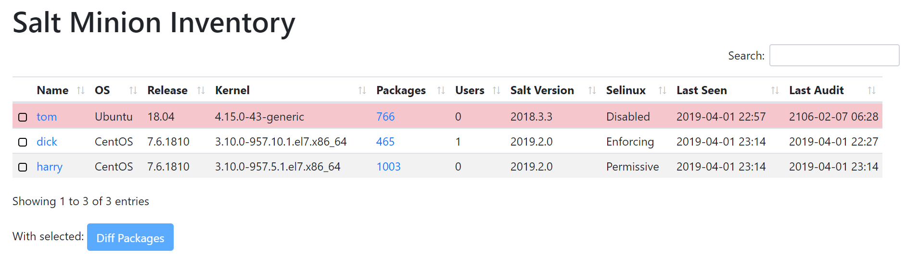
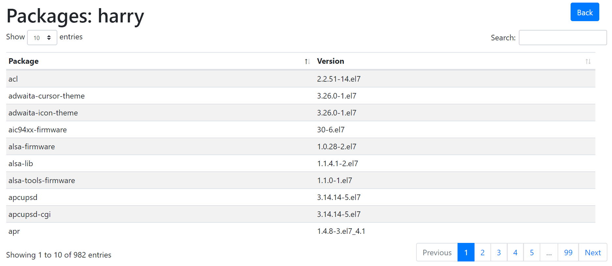
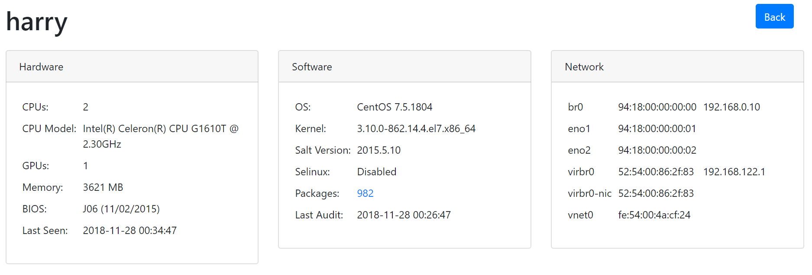

# Salt-Minion-Inventory

Provides a web based interface to your SaltStack minions to view their state, hardware, software and package information.

[Bootstrap](https://getbootstrap.com), [Datatables.net](https://datatables.net) and [jQuery](https://jquery.com) are used to create the user interface.

Data about the minions are stored in a MySQL database.

SaltStack events, reactors and a runner are used to keep the data up to date.

Minions only report their state, packages etc. if they have changed. Minions will cache their data's md5sum value to `/var/tmp/salt_inventory_audit.cache`

## Screen Shots

Example inventory:


Example packages list for a minion:


Example package diff for two minions:


Example minion info:


## Requirements

* A web server that supports PHP (e.g. Apache)
* A MySQL server
* PHP MySQL support
* A web browser that supports JS and CSS
* a SaltStack master and minions
* MySQL-python module
* pytz python module

## Installation

### MySQL Database

Create a database, e.g. `salt_minion` to store the minion information like so:

```bash
mysql -u root < database.sql
```

Create a user for the database:

```sql
GRANT USAGE ON *.* TO 'salt_minion'@'%' IDENTIFIED BY PASSWORD 'salt_minion';

GRANT ALL PRIVILEGES ON `salt\_minion`.* TO 'salt_minion'@'%' WITH GRANT OPTION;
```

### Salt Configuration

Copy the contents of `/srv` directory to the `/srv` directory on your SaltStack master. You may want to exclude the `top.sls` files from the `pillar` and `salt` directories as these are just examples that show how to include the required files.

Create a directory to store the runner on the SaltMaster:

```bash
mkdir -p /var/lib/salt/runners
```

Copy `runners/inventory.py` and `runners/inventory.ini` into the directory. Note: change the MySQL variables to match the credentials that you used when creating the database above in `inventory.ini`.

Edit `/etc/salt/master` to enable the runner, presence events and reactors for responding to events:

```
extension_modules: /var/lib/salt

presence_events: True

reactor:
  - 'salt/presence/present':
    - /srv/reactor/inventory/present.sls
  - 'inventory/audit':
    - /srv/reactor/inventory/audit.sls
```

By default minions will run audit themselves once every six hours. This can be changed by editing `/srv/pillar/inventory.sls`

Now restart the SaltMaster:

```bash
systemctl restart salt-master
```

### Web Interface

Copy the contents of the `html` directory to a directory on your web server that is being served, e.g. `/var/www/html`

Edit `html/common.php` to match your MySQL database settings.

## Salt Commands

To force a minion to run an audit, run the following command:

```bash
salt minion01 inventory.audit force=True
```

## Debugging

If you experience problems then check the following files:

* /var/log/salt/master
* /var/log/salt/minion

Check the events that are being triggered and the results by watching for events on the Salt master:

```bash
salt-run state.event pretty=True
```

Run the `inventory.audit` function in debug mode:

```bash
salt -l debug '*' inventory.audit force=True
```

## Licensing

* Salt-Minion-Inventory is licensed under the [GPLv3 license](https://www.gnu.org/licenses/gpl-3.0.en.html)
* [Bootstrap](https://getbootstrap.com) is licensed under the [MIT license](https://opensource.org/licenses/MIT)
* [Datatables.net](https://datatables.net) is licensed under the [MIT license](https://opensource.org/licenses/MIT)
* [jQuery](https://jquery.com) is licensed under the [MIT license](https://opensource.org/licenses/MIT)
